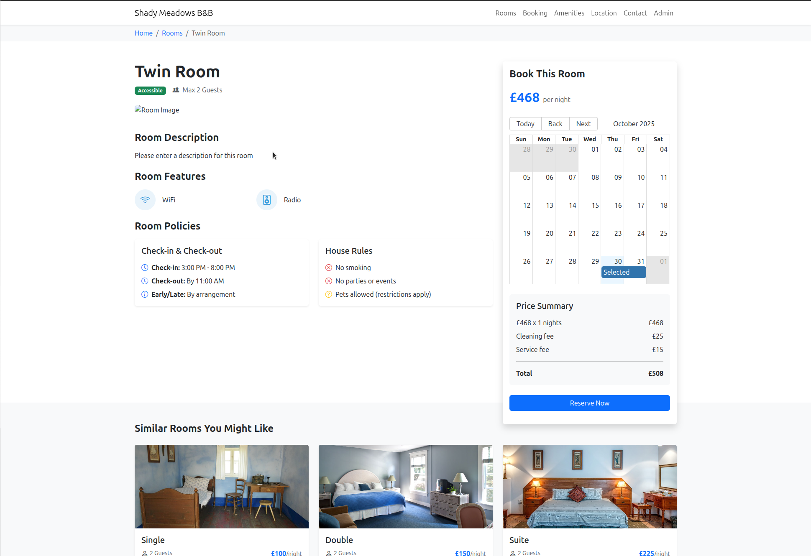

# Bug Report: user can manipulate URL to get to hidden room types when booking

## Description
The user can change the URL on the booking page to find additional rooms that are not displayed in the available room options

## Steps to Reproduce
1. go to the booking page for a room (e.g. https://automationintesting.online/reservation/1?checkin=2025-10-30&checkout=2025-10-31)
2. in this example, in the web address, change the 1 immediately after /reservation, to a 5 and hit enter

## Expected Behavior
The website should reject the request and provide an appropriate error to the user. 

## Actual Behavior
The user is able to view and book a room type that they was not presented as an available option

## Screenshots

## Environment
- Browser: Brave 1.84.132 (Official Build) (64-bit)
- OS: Ubuntu 24.04.3 LTS
- Screen Resolution: 2560 x 1440p

## Severity
- [ ] Low
- [ ] Medium
- [ ] High
- [X] Critical
