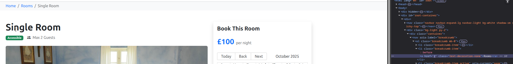

# Bug Report: Rooms breadcrumb does nothing when clicked

## Description
If the user is on the booking page, if they click rooms breadcrumb in the top left corner of the page, nothing happens. 

## Steps to Reproduce
1. go to the booking page for a room (e.g. https://automationintesting.online/reservation/1?checkin=2025-10-30&checkout=2025-10-31)
2. attempt to click the "Rooms" breadcrumb in the top left corner

## Expected Behavior
The website should take the user back to view all the rooms available.  

## Actual Behavior
Nothing happens when the breadcrumb is clicked 

## Screenshots

## Environment
- Browser: Brave 1.84.132 (Official Build) (64-bit)
- OS: Ubuntu 24.04.3 LTS
- Screen Resolution: 2560 x 1440p

## Severity
- [ ] Low
- [X] Medium
- [ ] High
- [ ] Critical
