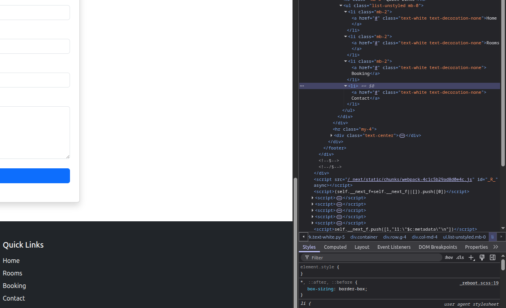

# Bug Report: Footer Hyperlinks do not link to the correct locations

## Description
If the user tries to click any of the Quick Links located in the Footer. All of them just scroll back to the top of the page and don't and do not take the user to the relevant part of the website. 

## Steps to Reproduce
1. Scroll to the bottom of the Homepage or Booking Page
2. Attempt to click any of the Quick Links located in the footer. 

## Expected Behavior
The website should take the user the associated part of the website.   

## Actual Behavior
All of the links just take to the user back to the top of the page they are on

## Screenshots

## Environment
- Browser: Brave 1.84.132 (Official Build) (64-bit)
- OS: Ubuntu 24.04.3 LTS
- Screen Resolution: 2560 x 1440p

## Severity
- [ ] Low
- [X] Medium
- [ ] High
- [ ] Critical