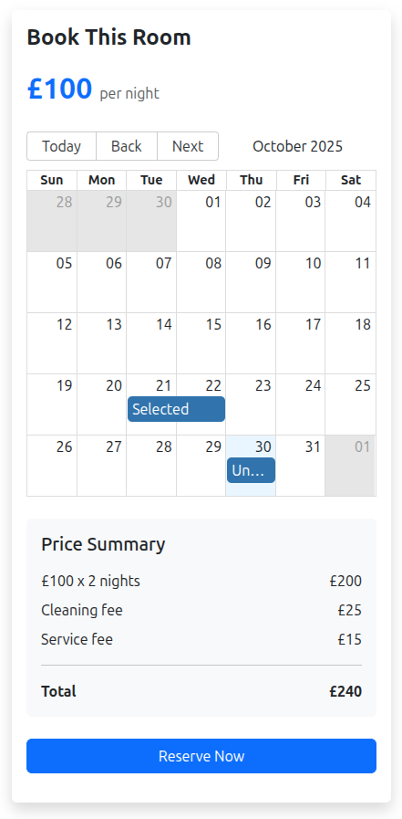

# Bug Report: User is charged based on total days rather than total nights when using booking calendar

## Description
When the user is looking to book a room, if they do the drag and drop on the calendar to select their dates. The price calculation effectively adds an extra days charge because it calculates the number of days rather than the number of nights.

## Steps to Reproduce
1. Go to a room Booking Page
2. Select your dates on the calendar widget 

## Expected Behavior
The updated cost calculation should only charge users for the total number of nights they are staying

## Actual Behavior
It incorrectly bases the cost on the total number of days

## Screenshots

## Environment
- Browser: Brave 1.84.132 (Official Build) (64-bit)
- OS: Ubuntu 24.04.3 LTS
- Screen Resolution: 2560 x 1440p

## Additional Information
If the user uses the initial dates set on the homepage, or they manipulate the dates directly in the URL, the Calculation is correct, it is only if it is done with the Calendar Widget that the price is wrong. 

## Severity
- [ ] Low
- [ ] Medium
- [ ] High
- [X] Critical