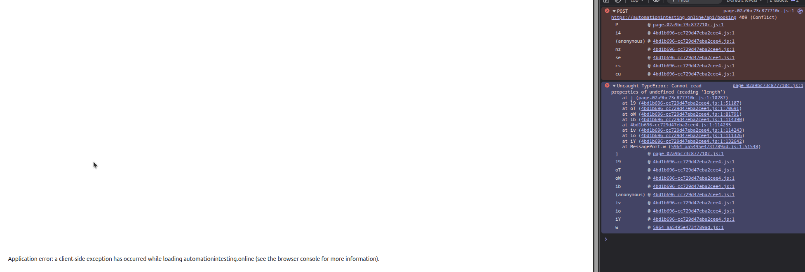

# Bug Report: User gets a server error when attempting to book a room that is unavailable 

## Description
When the user attempts to book a room, if the room is unavailable, the user is still able to attempt to book and gets a server error rather than the application preventing their attempt. 

## Steps to Reproduce
1. Book a room and take a note of the room type and date. 
2. Confirm booking and go back to homepage
3. attempt to book the same room and date that you booked previously

## Expected Behavior
The application should stop the user from entering their details to reserve the room as it is already taken. 

## Actual Behavior
The user is allowed to enter their details and submit to the server, which returns an error which is not user friendly 

## Screenshots

## Environment
- Browser: Brave 1.84.132 (Official Build) (64-bit)
- OS: Ubuntu 24.04.3 LTS
- Screen Resolution: 2560 x 1440p

## Severity
- [ ] Low
- [ ] Medium
- [ ] High
- [X] Critical