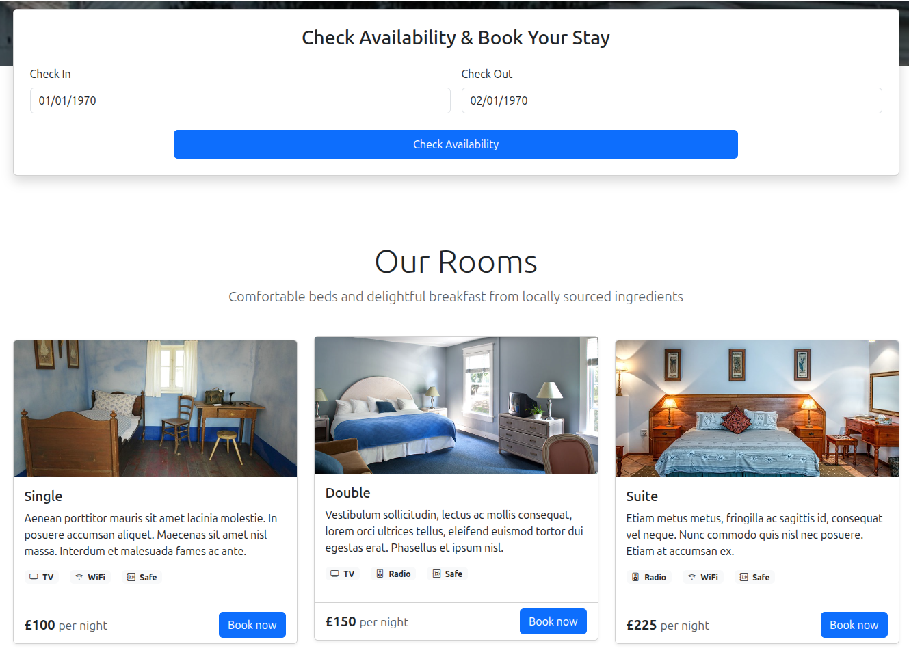

# Bug Report: No Data Validation on Date Availablity

## Description
When the user is entering the dates they would like to book. There is no validation performed to check if the dates are valid. For example they could book dates in 1970, Or have the check in date after the check out date. The website accepts both of these examples and allows the user to book. 

## Steps to Reproduce
1. open the homepage or specific room booking page
2. find the availability section and enter an invalid time period (i.e in the past)
3. attempt to book this timeslot

## Expected Behavior
The website should reject the request and provide an appropriate error message to the user. 

## Actual Behavior
The user is able to book their invalid date. 

## Screenshots

## Environment
- Browser: Brave 1.84.132 (Official Build) (64-bit), Chromium: 142.0.7444.60
- OS: Ubuntu 24.04.3 LTS
- Screen Resolution: 2560 x 1440p

## Severity
- [ ] Low
- [ ] Medium
- [ ] High
- [X] Critical
