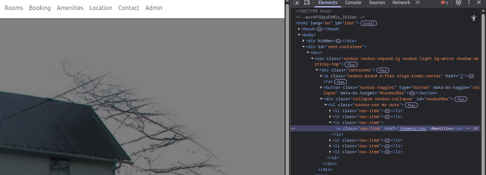

# Bug Report: Amenities navigation link is broken

## Description
The Navigation section of the website contains a link for "Amenities". If the user clicks the link nothing currently happens

## Steps to Reproduce
1. open the navigation panel (if not already open)
2. click "Amenities"

## Expected Behavior
The Website should take the user to to a part of the website with a full list of the B&Bs amenities

## Actual Behavior
Nothing happens 

## Screenshots

## Environment
- Browser: Brave 1.84.132 (Official Build) (64-bit), Chromium: 142.0.7444.60
- OS: Ubuntu 24.04.3 LTS
- Screen Resolution: 2560 x 1440p

## Severity
- [ ] Low
- [ ] Medium
- [X] High
- [ ] Critical
